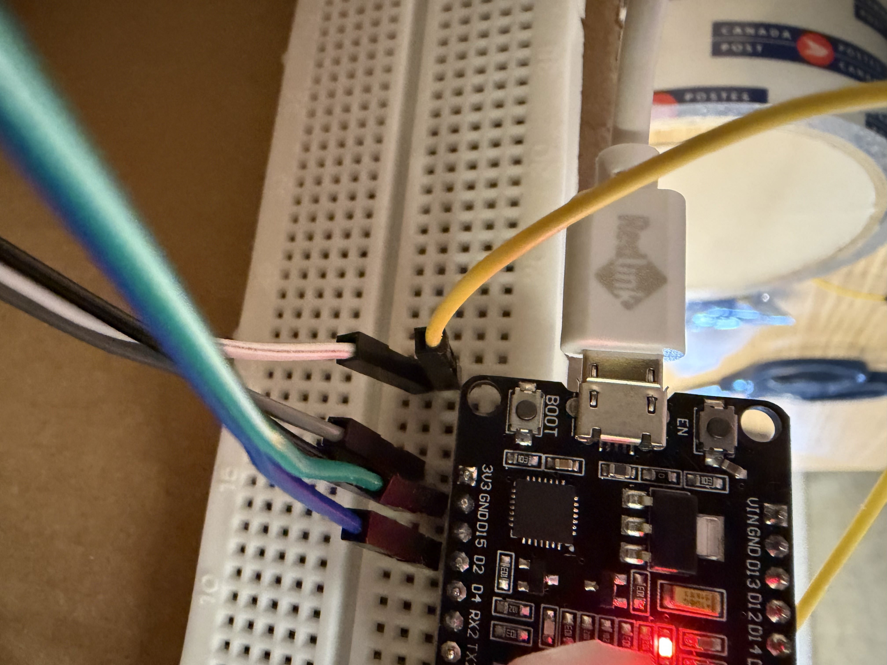
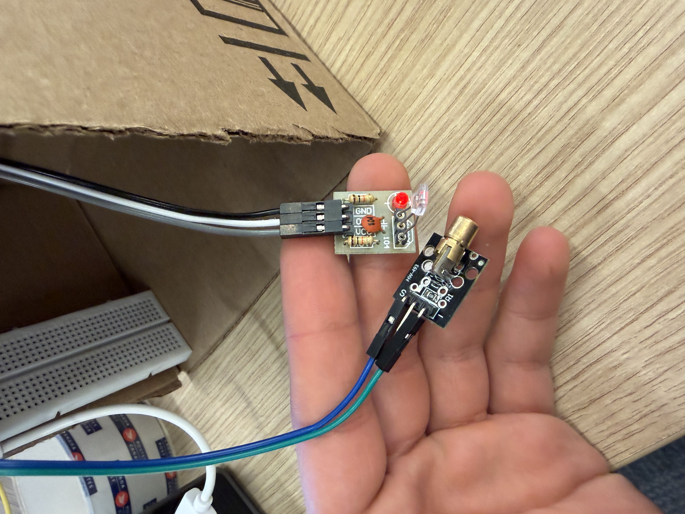
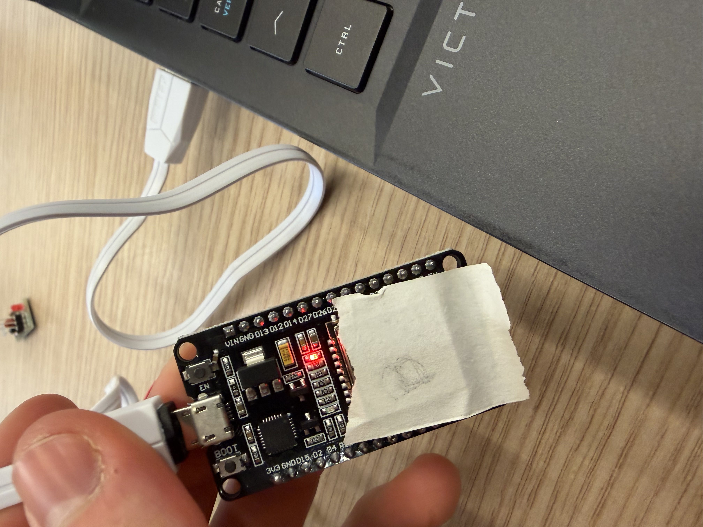

# Laser Security System - Sentry Pro

An automated laser tripwire security system using ESP32 microcontrollers and a Flask web server.

## Project Team
- Mohamed-Amine Moustakbal
- Ales Laiche
- Hyunseo Jeong
- Sitan Zhou

## Features
- Real-time laser tripwire detection
- Web-based control interface
- Automatic Alt+Tab trigger on alarm
- ARM/DISARM system controls
- Serial communication with ESP32

## Hardware Components
- ESP32 microcontrollers (ESP A and ESP B)
- Laser module
- Photoresistor/Light sensor

## Hardware Setup

### Laser and Sensor Connections


### Board A - Complete Setup


### ESP B - PC Connection


## Wiring Connections

### Laser Sensor (connected to ESP32)
- **GND** → GND on ESP32
- **VCC** → 3.3V on ESP32
- **Output** → Pin 34 on ESP32

### Laser Module (connected to ESP32)
- **VCC** → Pin 2 on ESP32
- **GND** → GND on ESP32

**Important:** Ensure you have a sufficient power supply for the protocol to work correctly.

### PC Connection
- **ESP B** is connected to the PC via USB for serial communication

## Setup

### Requirements
```bash
pip install flask pyserial pyautogui
```

### ESP Configuration
1. **ESP A**: Upload the sketch from `ESP A/sketch_jan17d/`
2. **ESP B**: Upload the sketch from `ESP B/sketch_jan17c/`

### Running the Server
```bash
python tripwire_server.py
```

The web interface will be available at `http://localhost:5000`

## Configuration
- Update `SERIAL_PORT` in `tripwire_server.py` to match your COM port (e.g., COM3, COM4)
- Default baud rate: 115200

## Usage
1. Connect ESP32 devices to your computer
2. Run the Flask server
3. Open the web interface
4. Use ARM/DISARM buttons to control the system
5. When the laser is broken, the system triggers an automatic Alt+Tab

© 2026 Sentry Pro Security Solutions
